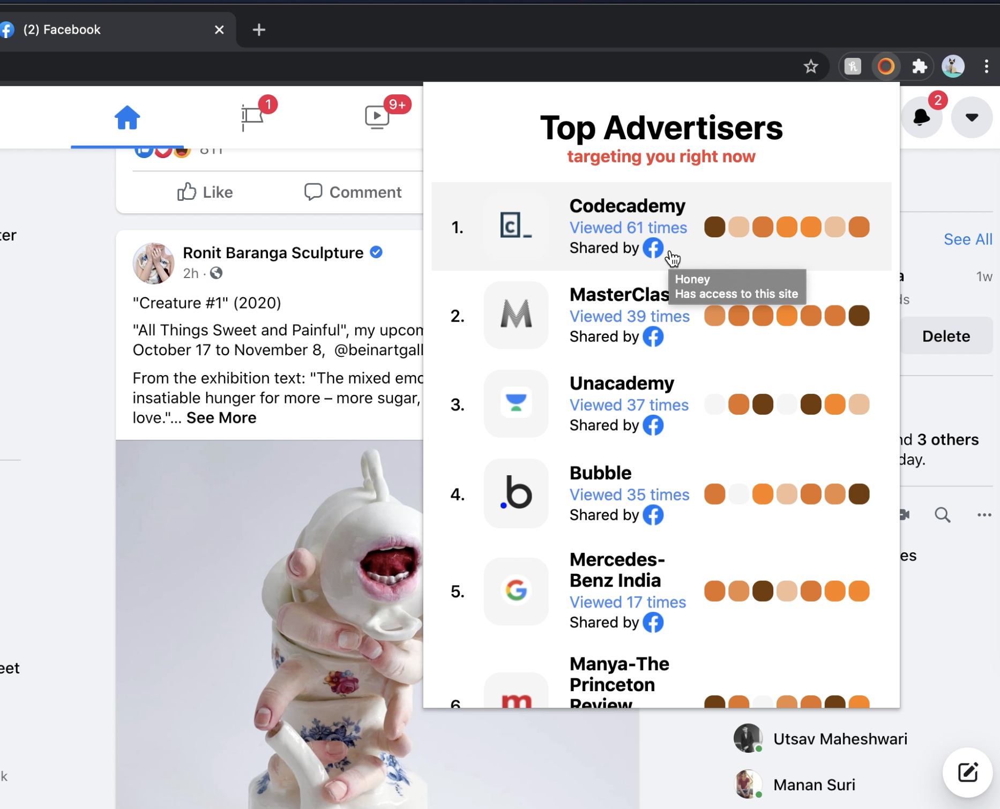

## Get weekly analytics on your advertisers as they do on you!

Advertisers get analytics on you. This chrome extension help you get daily analytics on them. Successful advertisements rarely succeed through calls to action. Instead, they create positive memories and feelings that influence our behavior over time to encourage us to buy something at a later date. It is important for users to be mindful of impact these advertisements have on us. 
[Learn more](https://devpost.com/software/know-your-advertisers)

## Video Demo

https://www.youtube.com/watch?v=YPoXEd2MWXE

## How I build it

After a few hours of foraging through the network logs, I reverse engineered facebook's API endpoint to find info about the advertisers and the ads. I then created a chrome extension that dynamically collected these details by extending native XHR and intercepting \graphql requests. An Idle data collector sends the data from the content script to the background script to store the data in local storage. Popup screen makes requests to get the data using a similar websocket connection.

## Instructions

### Download the repository

    git clone https://github.com/parthraghav/Know-Your-Advertisers AdvertiserSummary
    cd AdvertiserSummary

### (Chrome) Install the extension

Upload the dist folder as unpacked extension to Chrome

### (Chrome) Development

    yarn install
    npm run dev
    yarn build

## Milestones

The project was made at the RiceHacks Hackathon. Following are some of the upcoming milestones:

-   [ ] **Include weekly graphs.** I include a github-like calendar to visually display ad occurances in the feed. Adding more analytics and graphs (daily and weekly) would be the way to go.
-   [ ] **Make similar ad parser for Google.** Twitter Web Client, Instagram Web Client, Yahoo, and Amazon.
-   [ ] **Categorise ads based on their political motif.** The tool can be proved powerful if we could measure political polarity of the feed by checking out how many ads you see from politicians from both the aisles.

## Contributing

I'm open sourcing the code that I have written so far in hope that like-minded fellows can join me in my mission to create a healthier and balanced internet. ❤️️

## References

1. https://www.theatlantic.com/business/archive/2011/08/why-good-advertising-works-even-when-you-think-it-doesnt/244252/
2. https://www.newyorker.com/tech/annals-of-technology/the-problem-of-political-advertising-on-social-media
3. https://www.wgbh.org/news/politics/2019/11/06/why-dont-truth-in-advertising-laws-apply-to-political-ads
4. https://web.stanford.edu/~siyengar/research/papers/advertising.html
5. https://www.apa.org/monitor/2012/04/advertising

## License

MIT
